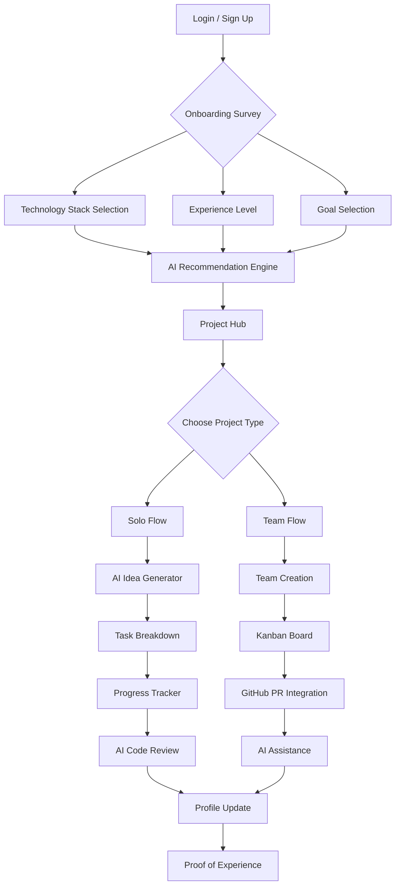

# User Flow Diagram

```mermaid
flowchart TD
    A[Login / Sign Up] --> B{Onboarding Survey}
    B --> C[Technology Stack Selection]
    B --> D[Experience Level]
    B --> E[Goal Selection]
    C --> F[AI Recommendation Engine]
    D --> F
    E --> F
    F --> G[Project Hub]
    G --> H{Choose Project Type}
    H --> I[Solo Flow]
    H --> J[Team Flow]
    I --> K[AI Idea Generator]
    K --> L[Task Breakdown]
    L --> M[Progress Tracker]
    M --> N[AI Code Review]
    N --> O[Profile Update]
    J --> P[Team Creation]
    P --> Q[Kanban Board]
    Q --> R[GitHub PR Integration]
    R --> S[AI Assistance]
    S --> O[Profile Update]
    O --> T[Proof of Experience]
```
